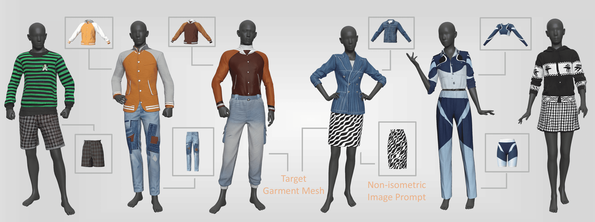

# NI-Tex: Non-isometric Image-based Garment Texture Generation

<div align="Middle">
  <a href=https://arxiv.org/abs/2511.18765 target="_blank"></a>
  <a href=https://huggingface.co/Hui-S-02/NI-Tex target="_blank"></a>
  <a href="https://huggingface.co/datasets/Hui-S-02/NI-Tex/tree/main" target="_blank">
  </a>
</div>

## 🌟 Overview

**NI-Tex** introduces a novel approach to non-isometric garment texture generation by utilizing a physically simulated dataset, 3D Garment Videos, which provides consistent geometry and material supervision across diverse deformations. The method employs *Nano Banana* for high-quality non-isometric image editing, enabling reliable cross-topology texture generation. Additionally, an iterative baking process guided by uncertainty-driven view selection merges multi-view predictions into seamless, production-ready PBR textures. This results in versatile, spatially aligned garment materials, advancing industry-level 3D garment design. 🙌🙌🙌

---

## 🎯 TODO List
- [x] 🚀 Inference Code
- [x] 📥 Model Checkpoints
- [x] 📂 Training Dataset
- [x] 🏋️‍♂️ Training Code


---

## Get Started with NI-Tex 
<!--   -->
### 🛠️ Preparation
1. **💻 Environments.** (cuda 12.4 on H100/H200)

```
git clone --recursive https://github.com/SII-Hui/NI-Tex.git
cd NI-Tex
conda env create -f environment.yml
conda activate NI-Tex

pip install basicsr==1.4.2 gfpgan==1.3.8 realesrgan==0.3.0 --no-deps

pip install torch-scatter torch-sparse torch-cluster torch-spline-conv torch-geometric -f https://data.pyg.org/whl/torch-2.5.1+cu124.html

pip install custom_rasterizer/.
```

2. **📥 Pretrained Model Weights.**

You need to manually download the RealESRGAN weight to the `ckpt` folder using the following command:
```bash
wget https://github.com/xinntao/Real-ESRGAN/releases/download/v0.1.0/RealESRGAN_x4plus.pth -P ckpt
```

Download the pre-trained weights from [Hugging Face: NI-Tex](https://huggingface.co/Hui-S-02/NI-Tex) and place them in the `./MODEL_CHECKPOINTS/` directory.

---
### 🚀 Inference Code

To get started quickly, place your custom data into a newly created folder under the `asset/cases` directory. Please ensure your files follow this specific naming convention:

* **🧵 Mesh file:** Rename your provided mesh to `mesh.glb`.
* **🖼️ Image prompt:** Rename your provided image prompt to `image_prompt.png`.

**📁 Example Directory Structure:**

```text
asset/
└── cases/
    └── your_custom_folder/
        ├── mesh.glb
        └── image_prompt.png

```


**⚙️ Configuration & Tuning:**

* **`--orth_scale`**: Controls the Stage 1 object size, which directly affects Stage 2 multi-view generation. Fine-tune this value for optimal results.
* **`resume_from` (in `inference.yml`)**: We recommend `MODEL_CHECKPOINTS/step_100K.ckpt` for most cases. Use `step_200K.ckpt` for extreme or challenging inputs.

```
cd NI-Tex
python inference.py --name "GeneratedMesh_shirt" --base cfgs/inference.yml --orth_scale 1.35 --output_dir InferenceResults/
```
---
### 📂 Training Dataset

Our dataset rendering pipeline is inspired by [MaterialAnything](https://github.com/3DTopia/MaterialAnything), utilizing assets from **Objaverse 🌍**, **Texverse 🌍**, and **BEDLAM 👕**. 

We edited the BEDLAM data using **Nano Banana 🍌** and rendered this massive dataset via Blender Python across a cluster of **48 RTX 4090 GPUs 🖥️**.

To support future research, we plan to open-source our **entire training dataset** at [Hugging Face: NI-Tex Dataset](https://huggingface.co/datasets/Hui-S-02/NI-Tex)(to our knowledge, the first of its kind). As data preparation takes time, we will release it in the following order:

- [x] 1. `Bedlam_edited_by_NanoBanana` ✨
- [x] 2. `BEDLAM` (Rendered) 👕
- [ ] 3. `Texverse` (Rendered) 🌍
- [ ] 4. `Objaverse` (Rendered) 🌍
---
### 🏋️‍♂️ Training Code

```
python train.py --base cfgs/hunyuan-paint-pbr.yaml --name overfit --logdir training_logs/ --gpus 0,
```

---
## 🎥 Video Demo


---
## 💖 Acknowledgement
We have intensively borrow codes and dataset from the following repositories. Many thanks to the authors for sharing.
- 🔗 [Hunyuan3D-2.1](https://github.com/Tencent-Hunyuan/Hunyuan3D-2.1)
- 🔗 [MaterialAnything](https://github.com/3DTopia/MaterialAnything)
- 🔗 [Objaverse](https://huggingface.co/datasets/allenai/objaverse)
- 🔗 [Texverse](http://huggingface.co/datasets/YiboZhang2001/TexVerse)
- 🔗 [Bedlam](https://github.com/pixelite1201/BEDLAM)
- 🔗 [4DDress](https://github.com/eth-ait/4d-dress)


## 📜 Citation
If you find this repository useful in your project, please cite the following work. :)
```
@article{shan2025ni,
  title={NI-Tex: Non-isometric Image-based Garment Texture Generation},
  author={Shan, Hui and Li, Ming and Yang, Haitao and Zheng, Kai and Zheng, Sizhe and Fu, Yanwei and Huang, Xiangru},
  journal={arXiv preprint arXiv:2511.18765},
  year={2025}
}
```